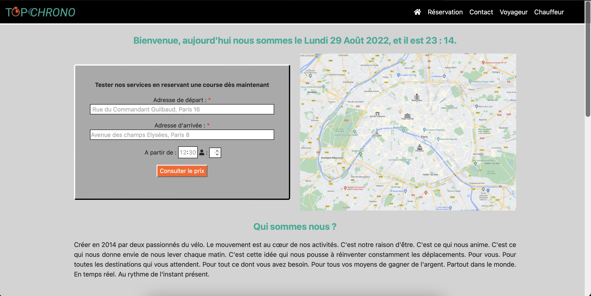

# README
Ce projet est un site fictif de réservation de triporteur, développé en front  html  css et javascript.  

Il est possible de naviguer sur les différentes pages via la barre de navigation présente sur toutes les pages.


==============================================

This project is a fictitious scooter reservation site, developed in front html css and javascript.

You can browse in different pages via the navbar present in all of pages. 


La page d'accueil : / The home page : 



##### <center> *Fig.1 page d'accueil* </center> <br>


## 1. Installation

Vous devez cloner le dossier avec la commande suivante : 

==============================================

You have to clone the repository with this command line : 


```bash
$ git clone <repository>
```


## 2. Lancement 

Le projet se lance en ouvrant le fichier "index.html" sur un navigateur. 

==============================================

For launch the project you have to open the file "index.html" in a browser.